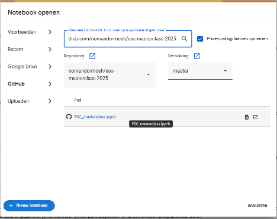
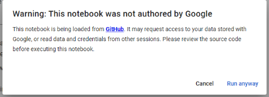

# Hands-on Workshop 1 : Use of large-language models in clinical cardiology

## Option 1: Chat with clinical data using an AI virtual assistant

<a href="https://raw.githubusercontent.com/nomandormosh/esc-masterclass-2025/master/va.docx">
Download/view the hands-on material</a>

## Option 2: Prompt engineering for clinical cases

<a href="https://raw.githubusercontent.com/nomandormosh/esc-masterclass-2025/master/pe.docx">
Download/view the hands-on material</a>

## Option 3: Trustworthy Generative AI: Improving routine care through application of Retrieval-augmented generation of clinical guidelines

**Instructions:**
1. Open the browser and navigate to Google’s Colab, then click on the sign in button
   <https://colab.research.google.com/>

2. Login using your google account username and password
3. You will see “Open notebook” window
   * Click on github from the left tabs
   * Cancel the authorization procedure
   * Fill in the URL <https://github.com/nomandormosh/esc-masterclass-2025>
     
  

4. Select the desired notebook.
   * ESC\_masterclass -> for heart failure ESC guidelines (English)
5. When you run your first code you will get the following warning message which you can safely ignore

   

7. Good luck!

